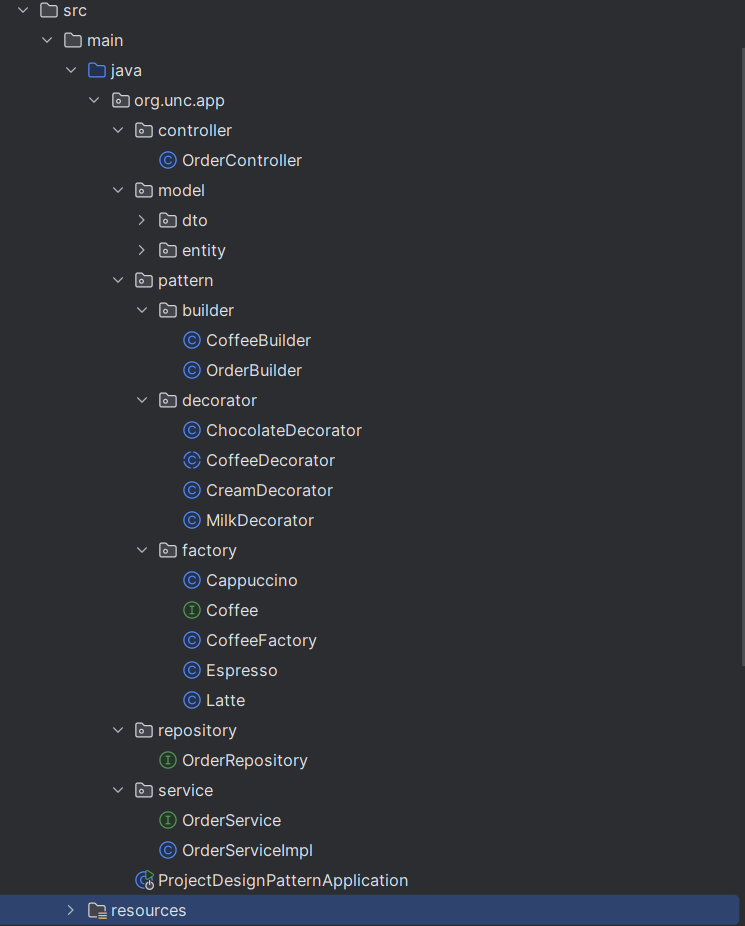

# ☕ Coffee Ordering System

Sistema de pedidos de café desarrollado en **Java** usando **Spring Boot**, **JPA/Hibernate** y **MySQL**.  
Se ha diseñado siguiendo principios de arquitectura limpia (**Clean Architecture**) y aplicando patrones de diseño como **Factory**, **Decorator** y **Builder**.

---

## 📋 Descripción

Este sistema permite:
- Crear cafés base usando **Factory Pattern**.
- Personalizar cafés con ingredientes extra mediante **Decorator Pattern**.
- Construir pedidos completos con **Builder Pattern**.
- Guardar las órdenes en una base de datos MySQL mediante Spring Data JPA.

---

## 🏗 Patrones de diseño implementados

### 1️⃣ Factory Pattern
- **Ubicación:** `org.unc.app.pattern.factory`
- **Función:** Crear instancias de diferentes tipos de café (`Espresso`, `Latte`, `Americano`, etc.) sin exponer la lógica interna de construcción.
- **Ventajas:**
    - Centraliza la creación de objetos.
    - Facilita la extensión con nuevos tipos de café.

### 2️⃣ Decorator Pattern
- **Ubicación:** `org.unc.app.pattern.decorator`
- **Función:** Añadir dinámicamente ingredientes adicionales a un café sin modificar las clases base.
- **Ventajas:**
    - Flexibilidad para agregar ingredientes en tiempo de ejecución.
    - Composición de objetos en lugar de herencia rígida.

Ejemplo de ingredientes:
- `MilkDecorator` → Leche
- `CreamDecorator` → Crema
- `ChocolateDecorator` → Chocolate

### 3️⃣ Builder Pattern
- **Ubicación:**
    - `CoffeeBuilder` → Construye objetos `Coffee` combinando café base y decoradores.
    - `OrderBuilder` → Construye objetos `Order` para registrar pedidos.
- **Ventajas:**
    - Separa la construcción compleja de un objeto de su representación final.
    - Permite encadenar métodos (`method chaining`) para una sintaxis más limpia.
---
## Configuración de Spring Boot para MySQL
Para conectar la aplicación con una base de datos MySQL, configura el archivo `application.properties` de la siguiente forma:
```properties
# Nombre de la aplicación
spring.application.name=project_design_pattern

# Configuración de la conexión a MySQL
spring.datasource.url=jdbc:mysql://localhost:3306/coffee_db
spring.datasource.username=root
spring.datasource.password=12345
#spring.datasource.driver-class-name=com.mysql.cj.jdbc.Driver  # Opcional, se auto-configura

# Configuración JPA / Hibernate
spring.jpa.hibernate.ddl-auto=create   # Para crear las tablas automáticamente en cada arranque (usar con precaución)
spring.jpa.show-sql=true               # Mostrar sentencias SQL en consola
#spring.jpa.properties.hibernate.dialect=org.hibernate.dialect.MySQL8Dialect  # Opcional para especificar dialecto
```

## 📂 Estructura del proyecto
